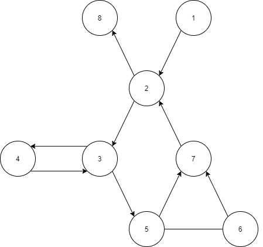
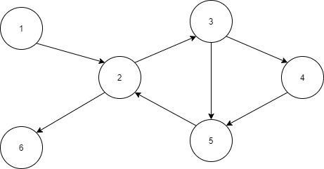

# Chapter 7 - Section 2 - Subsection 3 - Exercise 1

## Question
Below are four graphs, each of which is defined by the sets of nodes, initial nodes, final nodes, edges, and defs and uses. Each graph also contains some test paths. Answer the following questions about each graph.

## Graph I

### (a) Draw the graph.

### (b) List all of the du-paths with respect to x. (Note: Include all dupaths, even those that are subpaths of some other du-path)
DU-paths of given graph:

[1,2,8], [1,2,3,5,6], [4,3,5,6], [4,3,5,7,2,8], [4,3,5,6,7,2,8]

### (c) Determine which du-paths each test path tours. Write them in a table with test paths in the first column and the du-paths they cover in the second column. For this part of the exercise, you should consider both direct touring and sidetrips.

t1 = [1,2,8]  
t2 = [1,2,3,5,7,2,8]  
t3 = [1,2,3,5,6,7,2,8]  
t4 = [1,2,3,4,3,5,7,2,8]  
t5 = [1,2,3,4,3,4,3,5,6,7,2,8]  
t6 = [1,2,3,4,3,5,7,2,3,5,6,7,2,8]  

| Test path | DU-paths covered                          |
|-----------|-------------------------------------------|
| t1        | [1,2,8]                                   |
| t2        | [1,2,8]                                   |
| t3        | [1,2,8], [1,2,3,5,6]                      |
| t4        | [4,3,5,7,2,8]                             |
| t5        | [4,3,5,6], [4,3,5,6,7,2,8]                |
| t6        | [4,3,5,6], [4,3,5,7,2,8], [4,3,5,6,7,2,8] |

### (d) List a minimal test set that satisfies all defs coverage with respect to x. (Direct tours only.) If possible, use the given test paths. If not, provide additional test paths to satisfy the criterion. 
{t3, t5} is enough to cover All-Defs coverage

### (e) List a minimal test set that satisfies all uses coverage with respect to x. (Direct tours only.) If possible, use the given test paths. If not, provide additional test paths to satisfy the criterion. 
{t1, t3, t5} is enough to cover All-Uses coverage.

### (f) List a minimal test set that satisfies all du-paths coverage withrespect to x. (Direct tours only.) If possible, use the given test paths. If not, provide additional test paths to satisfy the criterion.
{t1,t3,t4,t5} is enough to cover All-Du-Paths Coverage

## Graph II

### (a) Draw the graph.

### (b) List all of the du-paths with respect to x. (Note: Include all dupaths, even those that are subpaths of some other du-path)
DU-paths of given graph:
[1,2,6], [1,2,3], [3,5,2,3], [3,5,2,6], [3,4,5,2,3], [3,4,5,2,6]

### (c) Determine which du-paths each test path tours. Write them in a table with test paths in the first column and the du-paths they cover in the second column. For this part of the exercise, you should consider both direct touring and sidetrips.

t1 = [1,2,6]  
t2 = [1,2,3,4,5,2,3,5,2,6]  
t3 = [1,2,3,5,2,3,4,5,2,6]  
t4 = [1,2,3,5,2,6]  

| Test path | DU-paths covered                          |
|-----------|-------------------------------------------|
| t1        | [1,2,6]                                   |
| t2        | [1,2,3], [3,4,5,2,3], [3,5,2,6]           |
| t3        | [1,2,3], [3,5,2,3], [3,4,5,2,6]           |
| t4        | [1,2,3], [3,5,2,6]                        |

### (d) List a minimal test set that satisfies all defs coverage with respect to x. (Direct tours only.) If possible, use the given test paths. If not, provide additional test paths to satisfy the criterion.
{t4} is enough to cover All-Defs coverage

### (e) List a minimal test set that satisfies all uses coverage with respect to x. (Direct tours only.) If possible, use the given test paths. If not, provide additional test paths to satisfy the criterion. 
{t1,t2} is enough to cover All-Uses coverage

### (f) List a minimal test set that satisfies all du-paths coverage withrespect to x. (Direct tours only.) If possible, use the given test paths. If not, provide additional test paths to satisfy the criterion.
{t1, t2, t3} is enough to cover All-Du-Paths Coverage

## Graph III

### (a) Draw the graph.
This graph is basically the same as Graph II but with different def-use pairs

### (b) List all of the du-paths with respect to x. (Note: Include all dupaths, even those that are subpaths of some other du-path)
DU-paths of given graph:

[1,2,6], [1,2,3], [1,2,3,5], [4,5], [4,5,2,3], [4,5,2,6] 

### (c) Determine which du-paths each test path tours. Write them in a table with test paths in the first column and the du-paths they cover in the second column. For this part of the exercise, you should consider both direct touring and sidetrips.

t1 = [1,2,3,5,2,6]  
t2 = [1,2,3,4,5,2,6]  

| Test path | DU-paths covered            |
|-----------|-----------------------------|
| t1        | [1,2,3], [1,2,3,5], [1,2,6] |
| t2        | [1,2,3], [4,5], [4,5,2,6]   |

### (d) List a minimal test set that satisfies all defs coverage with respect to x. (Direct tours only.) If possible, use the given test paths. If not, provide additional test paths to satisfy the criterion. 
{t1} is enough to cover All-Defs coverage

### (e) List a minimal test set that satisfies all uses coverage with respect to x. (Direct tours only.) If possible, use the given test paths. If not, provide additional test paths to satisfy the criterion. 
{t1,t2, [1,2,6],[1,2,3,4,5,2,3,5,2,6]} is enough to cover All-Uses coverage (Direct tour)

### (f) List a minimal test set that satisfies all du-paths coverage withrespect to x. (Direct tours only.) If possible, use the given test paths. If not, provide additional test paths to satisfy the criterion.
{t1,t2, [1,2,6],[1,2,3,4,5,2,3,5,2,6]} is enough to cover All-DU-Paths Coverage

## Graph IV

### (a) Draw the graph.
This graph is basically the same as Graph II but with different def-use pairs

### (b) List all of the du-paths with respect to x. (Note: Include all dupaths, even those that are subpaths of some other du-path)
DU-paths of given graph:
[1,2,6], [1,2,3,5], [1,2,3,4,5], [5,2,6], [5,2,3,5], [5,2,3,4,5]

### (c) Determine which du-paths each test path tours. Write them in a table with test paths in the first column and the du-paths they cover in the second column. For this part of the exercise, you should consider both direct touring and sidetrips.

t1 = [1,2,6]  
t2 = [1,2,3,4,5,2,3,5,2,6]  
t3 = [1,2,3,5,2,3,4,5,2,6]  

| Test path | DU-paths covered                           |
|-----------|--------------------------------------------|
| t1        | [1,2,6]                                    |
| t2        | [1,2,3,4,5], [5,2,3,5], [5,2,6]            |
| t3        | [1,2,3,5], [5,2,3,4,5], [5,2,6]            |

### (d) List a minimal test set that satisfies all defs coverage with respect to x. (Direct tours only.) If possible, use the given test paths. If not, provide additional test paths to satisfy the criterion. 
{t2} is enough to cover All-Defs coverage.

### (e) List a minimal test set that satisfies all uses coverage with respect to x. (Direct tours only.) If possible, use the given test paths. If not, provide additional test paths to satisfy the criterion.
{t1, t2} is enough to cover All-Uses coverage

### (f) List a minimal test set that satisfies all du-paths coverage withrespect to x. (Direct tours only.) If possible, use the given test paths. If not, provide additional test paths to satisfy the criterion.
{t1, t2, t3} is enough to cover All-DU-Paths coverage