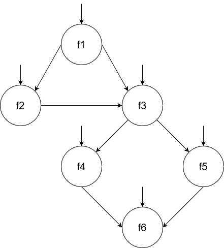

# Exercise 3 - Section 4 - Chapter 7

## Question
Use the following program fragment for questions a–e below.  
```java
public static void f1 (int x, int y)
{
if (x < y) { f2 (y); } else { f3 (y); };
}
public static void f2 (int a)
{
if (a % 2 == 0) { f3 (2*a); };
}
public static void f3 (int b)
{
if (b > 0) { f4(); } else { f5(); };
}
public static void f4() {... f6()....}
public static void f5() {... f6()....}
public static void f6() {...}
```
Use the following test inputs:  
- t1 = f1 (0, 0)
- t2 = f1 (1, 1)
- t3 = f1 (0, 1)
- t4 = f1 (3, 2)
- t5 = f1 (3, 4)  


### (a) Draw the call graph for this program fragment.
  
- All *public* is potentially an initial node


### (b) Give the path in the graph followed by each test.
- t1: [f1, f3, f5, f6]
- t2: [f1, f3, f4, f6]
- t3: [f1, f2]
- t4: [f1, f3, f4, f6]
- t5: [f1, f2, f3, f4, f6]


### (c) Find a minimal test set that achieves Node Coverage.
- {t1, t2, t3}  
- {t1, t3, t4}  
- {t1, t5}  

### (d) Find a minimal test set that achieves Edge Coverage.
- {t1, t5}

### (e) Give the prime paths in the graph. Which prime path is not covered by any of the tests above?
Prime paths in the graph:
- [f1, f2, f3, f4, f6]  
- [f1, f2, f3, f5, f6]  
- [f1, f3, f4, f6]  
- [f1, f3, f5, f6]  

Prime path that is not covered by the test paths above:
- [f1, f2, f3, f5, f6]  