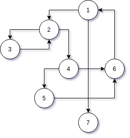

Answer questions a–g for the graph defined by the following sets:

Answer questions a–g for the graph defined by the following sets:

N = {1, 2, 3, 4, 5, 6, 7}

N 0 = {1}

N f = {7}

E = {(1, 2), (1, 7), (2, 3), (2, 4), (3, 2), (4, 5), (4, 6), (5, 6), (6, 1)}

Also consider the following (candidate) test paths:

p 1 = [1, 2, 4, 5, 6, 1, 7]

p 2 = [1, 2, 3, 2, 4, 6, 1, 7]

p 3 = [1, 2, 3, 2, 4, 5, 6, 1, 7]

(a) Draw the graph.

(b) List the test requirements for Edge-Pair Coverage. (Hint: You
should get 12 requirements of length 2.)

(c) Does the given set of test paths satisfy Edge-Pair Coverage? If
not, state what is missing.

(d) Consider the simple path [3, 2, 4, 5, 6] and test path [1, 2, 3, 2,
4, 6, 1, 2, 4, 5, 6, 1, 7]. Does the test path tour the simple path
directly? With a sidetrip? If so, write down the sidetrip.

(e) List the test requirements for Node Coverage, Edge Coverage,
and Prime Path Coverage on the graph.

(f) List test paths from the given set that achieve Node Coverage
but not Edge Coverage on the graph.

(g) List test paths from the given set that achieve Edge Coverage
but not Prime Path Coverage on the graph.

(a) 

(b) 

(1, 2, 3) (1, 2, 4) (2, 3, 2) (2, 4, 5) 

(2, 4, 6) (3, 2, 3) (3, 2, 4) (4, 5, 6) 

(4, 6, 1) (5, 6, 1) (6, 1, 2) (6, 1, 7) 

(c) Yes. (3, 2, 3) and (6, 1, 2)

(d) 

(e) (1, 2, 3, 2, 4, 5, 6, 1, 7) doesn't cover (4, 6)

(f) (1, 2, 3, 2, 4, 5, 6, 1, 2, 4, 6, 1, 7) doesn't cover (3, 2, 3)